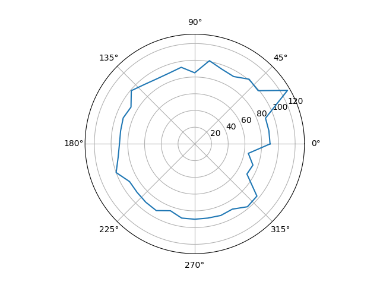

# Room Mapping

### An embedded system that maps its environment using an ultrasonic sensor

## Hardware Overview
In this project, a Beaglebone green wireless is used for the main processor of the board, while an Arduino ATMega256 is used for motor and sensor control. They communicate over the serial ports using COBS encoding.

#### Other Hardware
1. 360 degree feedback Servo motor
2. HC-SR04 Ultrasonic sensor

### Circuit Diagram [TODO]

### Software Overview
The Beaglebone is the main control unit of the system. It uses serial communication to tell the Arduino how to use the sensors and motors. The Arduino return information to the Beaglebone after completing the commands it receives. Then using this information, such as the distance the ultrasonic sensor perceives at a certain angle, it makes a map of the room. Once this is completed, I will be looking the take the system portable, and making a robotic car that can utilize the map information and more to navigate its environment. The Beaglebone is connected to the local network and sends HTTP requests to a Flask server running on my local machine. This enables me to visualize the data as it updates using a web browser

### Sample Map Visualization

### TODO
1. 360 degree feedback Servo motor control to rotate the ultrasonic sensor [COMPLETED]
2. Ultrasonic sensor functionality [COMPLETED]
3. Flask server that serves an endpoint over localhost to view the data visually using matplotlib [COMPLETED]
3. Attach ultrasonic sensor to servo and use it to calculate distances at different angles
3.
